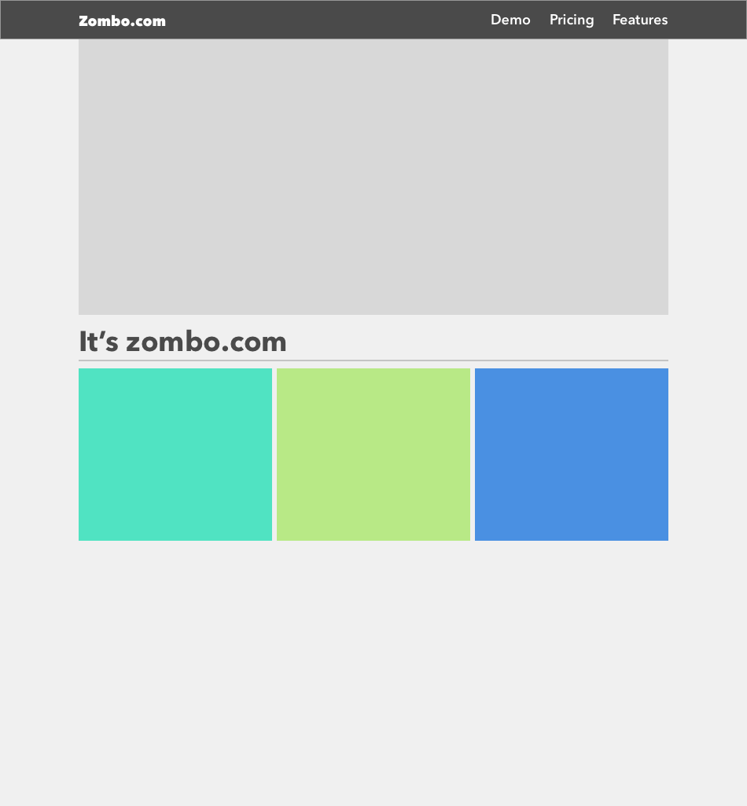
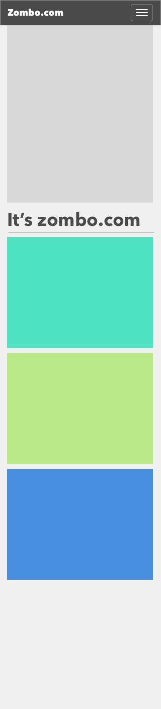

# Enoncé
Le but de cet exercice est de reproduire au plus proche le design de page web responsive suivant : 

**Desktop**

**Mobile**

## Solution demandée
Vous devez founir les sources et dépendances nécessaires pour pouvoir visualiser votre solution dans un navigateur web

### Infos sur le design
Police: "Avenir Next"

Couleurs de bloc: { gris: D8D8D8, bleu: 4A90E2, vert1: 50E3C2, vert2: B8E986 }

## Langages
HTML, CSS, JS et frameworks de votre choix. 

